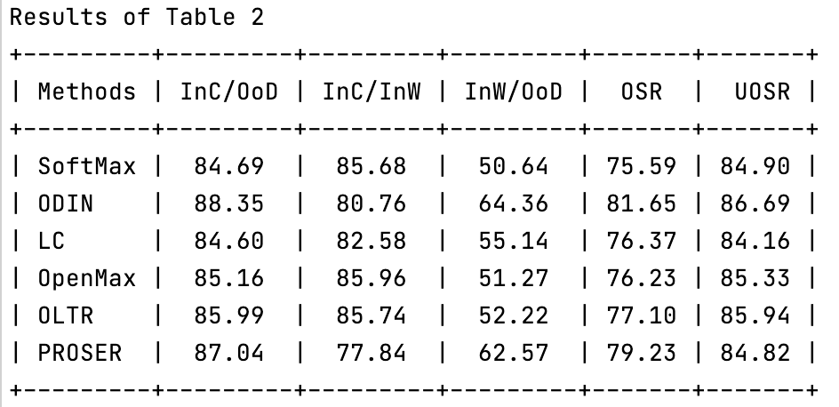
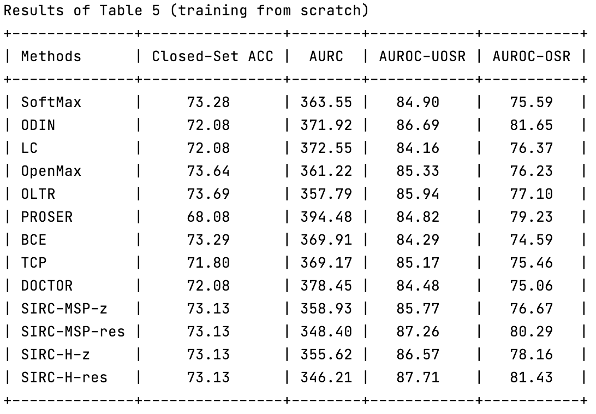
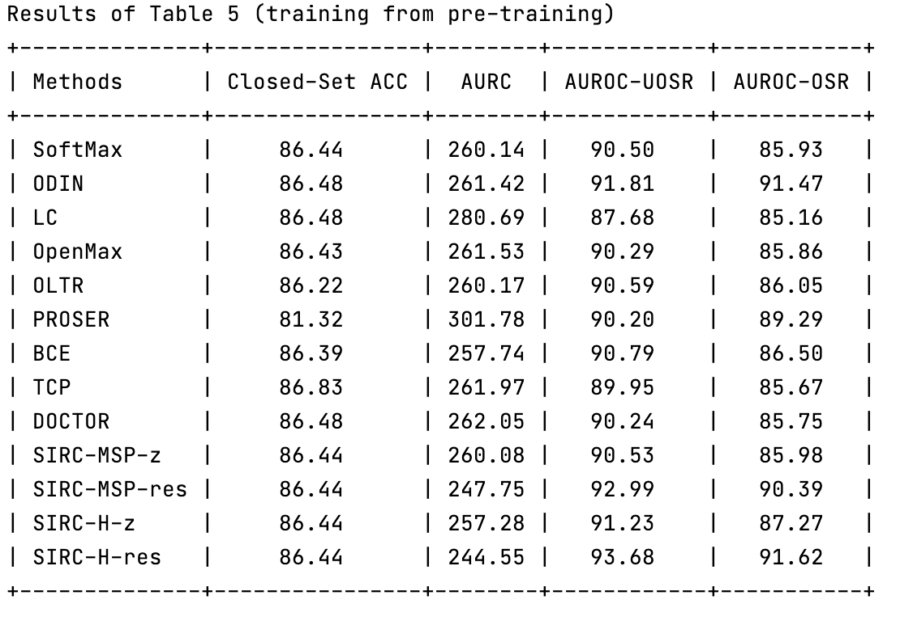
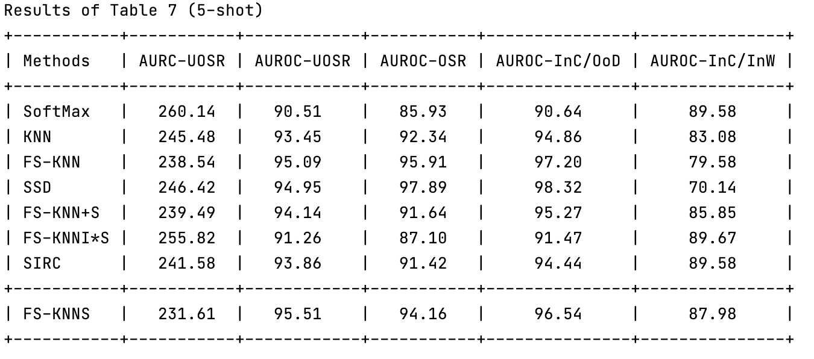
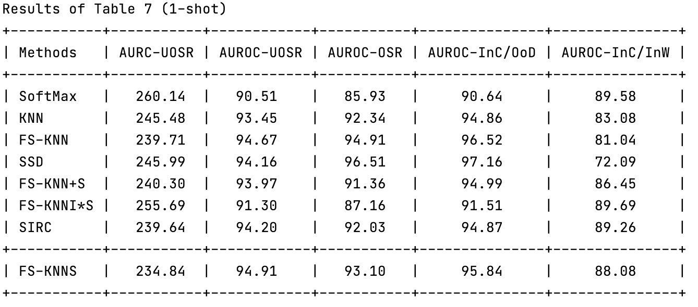

# **UOSR Evaluation**

## **Introduction**
We provide uncertainty scores of all methods mentioned in the main paper. For example, `./resnet50_image/TinyImageNet/SoftMax.npz` contains uncertainty scores of InD and OoD test samples of SoftMax method, so that we can directly evaluation the UOSR and other related performances based on the uncertainty distribution and ground truth. The user can obtain the results of Table 2, 3, 5, 6, 7, and 19 with this codebase. We give three examples including how to get Table 2, 5 and 7.

### **Table 2**
Table 2 is the UOSR and OSR performance comparasion based on the ResNet50 backbone in the image domain. OoD dataset is TinyImageNet.
```shell
./Table_2.sh
```
You should obtain this table in the terminal which is exactly same with Table 2 in the manuscript:

<div  align="center">    

</div>

### **Table 5**
Table 5 is the UOSR benchmark of ResNet50 backbone. OoD dataset is TinyImageNet. We split the evaluation into two steps: first evaluate without pre-training and second evaluate with pre-training. 

Evaluate without pre-training: 
```shell
./Table_5_scratch.sh
```
You should get this table in the terminal:

<div  align="center">    

</div>

Evaluate with pre-training: 
```shell
./Table_5_pre_training.sh
```

You should get this table in the terminal:
<div  align="center">    

</div>

These two tables form the entire Table 5 in the manuscript.

### **Table 7**
Table 7 is the few-shot UOSR result of ResNet50 backbone. OoD dataset is TinyImageNet. We provide how to get the results of 5-shot and 1-shot respectively.

5-shot:
```shell
./Table_7_5_shot.sh
```
You should get this table in the terminal:

<div  align="center">    

</div>

1-shot:
```shell
./Table_7_1_shot.sh
```
You should get this table in the terminal:

<div  align="center">    

</div>

These two tables form the entire Table 7 in the manuscript. More screenshot tables can be found in `./results_screenshot`.